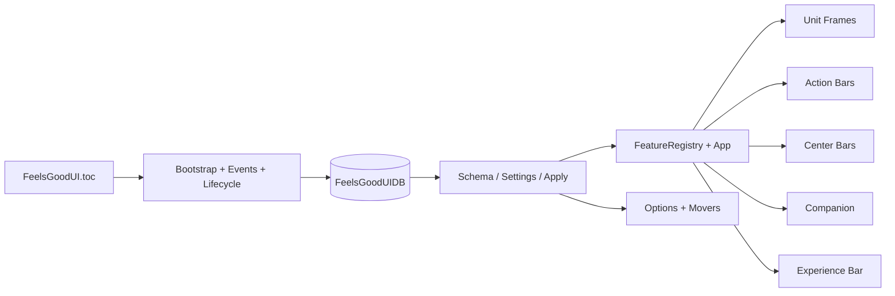

# Code graph

```mermaid
flowchart LR
  TOC["FeelsGoodUI.toc"] --> Core["Bootstrap + Events + Lifecycle"]
  Core --> DB[("FeelsGoodUIDB")]
  DB --> Settings["Schema / Settings / Apply"]
  Settings --> Registry["FeatureRegistry + App"]
  Registry --> UF["Unit Frames"]
  Registry --> AB["Action Bars"]
  Registry --> CB["Center Bars"]
  Registry --> Companion["Companion"]
  Registry --> XP["Experience Bar"]
  Settings --> UI["Options + Movers"]
```
